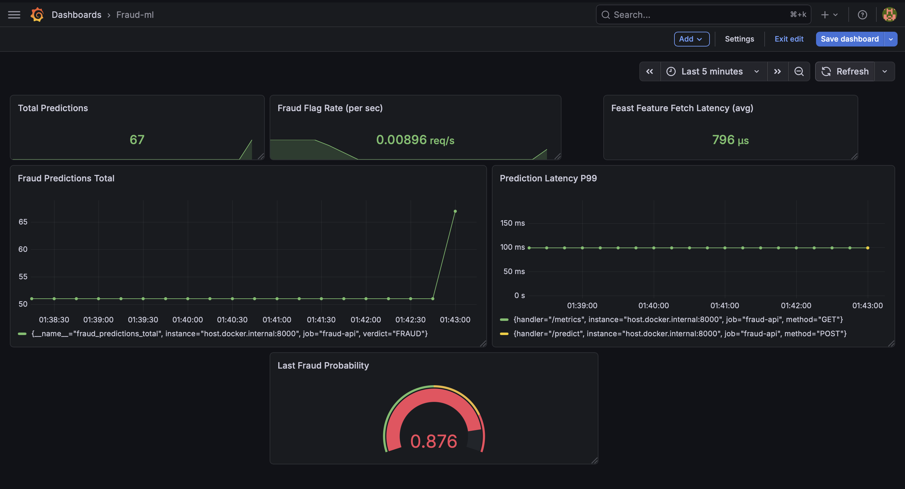

# Real-Time Fraud Detection ML Platform

An end-to-end streaming ML system that detects fraudulent e-commerce transactions with sub-second latency. Built with production-grade MLOps practices including an online feature store, model registry, drift monitoring, and automated retraining.

---

## Architecture
```
Kafka (Confluent) → PyFlink → Feast (Redis) → FastAPI (XGBoost) → Prediction
       ↓                                                                
      S3 ←――――――――――――――――――――――――――――――――――――――――――――――――――――――――――――
       ↓                                              
   Snowflake → dbt → Grafana
```

**Data flow:**
1. Kafka producer streams synthetic IEEE-CIS transactions to Confluent Cloud
2. PyFlink consumes events and computes 4 real-time features per user
3. Features are written to Feast online store (Redis/ElastiCache) at sub-millisecond latency
4. FastAPI inference endpoint fetches live features from Feast + runs XGBoost prediction
5. All events sink to Snowflake via S3 — dbt models build fraud analytics and PSI drift tables
6. Grafana dashboard monitors throughput, latency, fraud rate, and feature drift in real time
7. GitHub Actions triggers weekly retraining + drift-based retraining when PSI > 0.2

---

## Tech Stack

| Layer | Technology |
|-------|------------|
| Event streaming | Apache Kafka (Confluent Cloud) |
| Stream processing | PyFlink |
| Online feature store | Feast + Redis |
| Cloud feature store | AWS ElastiCache |
| ML model | XGBoost (AUC: 0.81) |
| Model serving | FastAPI on AWS EC2 |
| Model registry | AWS SageMaker Model Registry |
| Data lake | Amazon S3 |
| Data warehouse | Snowflake |
| Transformations | dbt Core |
| Monitoring | Grafana + Prometheus |
| CI/CD | GitHub Actions |

---

## Key Engineering Decisions

**Why point-in-time correct Feast joins for training?**
Training naively on full-dataset features causes training-serving skew — the most common source of silent ML degradation in production. Using `get_historical_features()` ensures each training example only uses feature values that were available at transaction time.

**Why Feast over direct Redis lookups?**
Feast enforces offline-online feature symmetry. The same feature definitions used to generate training data are used at serving time, eliminating the risk of inconsistent feature computation between training and inference.

**Why XGBoost over a neural network?**
XGBoost is the industry standard for tabular fraud detection. Interpretable feature importances, faster training, and no GPU requirement make it the correct choice for this domain. `scale_pos_weight=27.58` handles the 3.5% fraud rate class imbalance.

**Why PSI for drift detection?**
Population Stability Index quantifies how much the incoming feature distribution has shifted from training baseline. PSI > 0.1 = monitor, PSI > 0.2 = retrain. This is the standard drift metric used in financial ML systems.

---

## Model Performance

| Metric | Value |
|--------|-------|
| AUC-ROC | 0.8061 |
| Fraud Recall | 0.68 |
| Fraud Precision | 0.10 |
| Scale pos weight | 27.58 |
| Training set | 472,432 transactions |
| Test set | 118,108 transactions |

The model is tuned for high recall (catching fraud) over precision (minimizing false positives) — the correct default for fraud detection where missing a fraud is more costly than a false alert.

---

## Latency Benchmarks

| Operation | Latency |
|-----------|---------|
| Feast feature fetch (P99) | < 5ms |
| XGBoost inference | < 2ms |
| End-to-end prediction (P99) | ~100ms |
| Flink feature computation | real-time, 5-min windows |

---

## Grafana Dashboard



Panels:
- Total predictions counter
- Fraud flag rate (req/s)
- Last fraud probability (gauge)
- Prediction latency P99 (time series)
- Feast feature fetch latency (avg)

---

## Project Structure
```
fraud-ml-platform/
├── producer/           # Kafka producer + S3 sink
│   ├── producer.py     # Streams IEEE-CIS events to Kafka + S3
│   └── explore.py      # Dataset validation
├── flink/              # Stream processing
│   └── fraud_features.py  # Real-time feature computation
├── fraud_feast/        # Feature store
│   └── feature_repo/   # Feast definitions + offline parquet
├── model/              # ML training + registration
│   ├── train.py        # XGBoost training with Feast features
│   └── register_sagemaker.py  # SageMaker Model Registry
├── api/                # Inference serving
│   └── main.py         # FastAPI + Prometheus metrics
├── dbt_project/        # Analytics layer
│   └── fraud_ml/
│       └── models/
│           ├── staging/    # stg_transactions
│           └── marts/      # fraud analytics + PSI drift
├── monitoring/         # Observability
│   └── prometheus.yml  # Scrape config
├── .github/workflows/  # CI/CD
│   ├── retrain.yml     # Weekly scheduled retraining
│   └── drift_retrain.yml  # PSI-triggered retraining
└── docker-compose.yml  # Flink + Redis + Prometheus + Grafana
```

---

## How to Run Locally

**Prerequisites:** Python 3.11, Java 11, Docker, AWS account, Confluent Cloud account, Snowflake account

**1. Clone and set up environment:**
```bash
git clone https://github.com/sushpr127/fraud-ml-platform.git
cd fraud-ml-platform
python3.11 -m venv venv && source venv/bin/activate
pip install confluent-kafka pandas numpy boto3 python-dotenv \
            scikit-learn xgboost feast redis fastapi uvicorn \
            snowflake-connector-python dbt-snowflake \
            prometheus-fastapi-instrumentator
```

**2. Configure credentials:**
```bash
cp .env.example .env
# Fill in: Confluent, AWS, Snowflake credentials
```

**3. Start infrastructure:**
```bash
docker compose up -d
```

**4. Stream events:**
```bash
python3 producer/producer.py --speed 10 --limit 5000
```

**5. Start feature processor:**
```bash
python3 flink/fraud_features.py
```

**6. Materialize Feast features:**
```bash
cd fraud_feast/feature_repo
feast materialize 2019-01-01T00:00:00 $(date -u +"%Y-%m-%dT%H:%M:%S")
cd ../..
```

**7. Train model:**
```bash
python3 model/train.py
```

**8. Start API:**
```bash
uvicorn api.main:app --port 8000
```

**9. Test prediction:**
```bash
curl -X POST http://localhost:8000/predict \
  -H "Content-Type: application/json" \
  -d '{"user_id": "u_13926", "amount": 150.0, "product_cd": "W"}'
```

**10. View dashboards:**
- Grafana: http://localhost:3000 (admin/admin)
- Prometheus: http://localhost:9090
- Flink UI: http://localhost:8081

---

## Dataset

[IEEE-CIS Fraud Detection](https://www.kaggle.com/competitions/ieee-fraud-detection) — 590,540 e-commerce transactions with 3.5% fraud rate. Provided by Vesta Corporation via Kaggle.

---


## Author

**Sushanth Prabhu** — AI/ML Engineer  
[GitHub](https://github.com/sushpr127) · [LinkedIn](https://www.linkedin.com/in/sushanthpr/)
